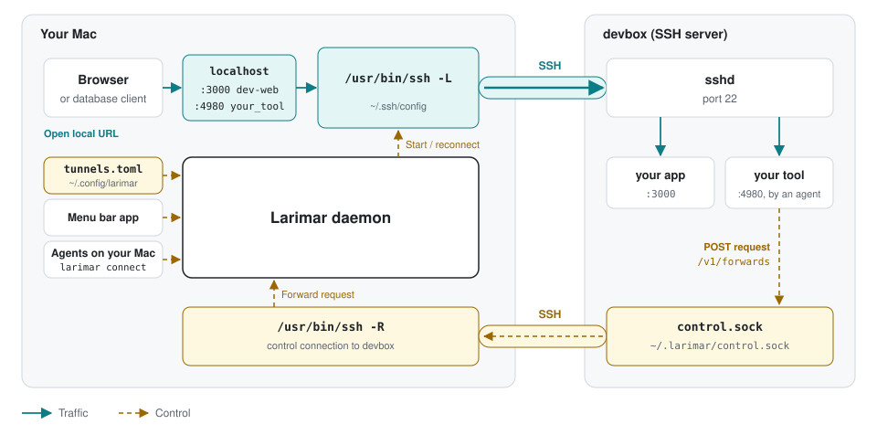

# Larimar

Larimar keeps SSH tunnels running on your Mac, reconnects after interruptions, and uses your existing `~/.ssh/config`. Reach remote web apps and databases locally, expose a Mac service to an SSH server, or use a SOCKS proxy.

- **Mac CLI:** agents and scripts run `larimar connect` and exit; the daemon keeps the tunnel running, and requests for the same tunnel ID share one connection.
- **Menu bar app:** connect or disconnect tunnels, check their status, and open forwarded web apps in your browser.
- **Remote control socket:** remote tools POST to `/v1/forwards` with `curl` over a Unix socket; approve new tunnels on your Mac, then open the returned local URL.

## How Larimar works



## Get started

Requires macOS 13+ and `/usr/bin/ssh`. Choose either installation method below.

### Option 1: Build from source

Requires Swift 5.9+ (Xcode Command Line Tools).

```sh
git clone https://github.com/plainbanana/Larimar.git
cd Larimar
make install
open ~/Applications/Larimar.app
```

This installs the menu bar app in `~/Applications` and the CLI in `~/.local/bin`. Add `~/.local/bin` to your `PATH` to use the commands below.

### Option 2: Nix / home-manager

Use `nix build` to build the CLI and app bundle, or `nix develop` for the development shell. For declarative configuration and launch at login, add the flake input and import the home-manager module:

```nix
# flake.nix
inputs.larimar.url = "github:plainbanana/Larimar";

# home.nix
imports = [ inputs.larimar.homeManagerModules.default ];
services.larimar = {
  enable = true;
  package = inputs.larimar.packages.aarch64-darwin.default;
  tunnels.dev-web = {
    ssh_host = "devbox";
    local_port = 3000;
    remote_port = 3000;
    auto_connect = true;
  };
};
```

Apply your home-manager configuration, then open `~/Applications/Larimar.app` if it is not already running.

The module generates `tunnels.toml`, adds the CLI to `PATH`, links the app into `~/Applications`, and starts it through launchd. Edit your Nix configuration instead of the generated TOML; the app's **Launch at Login** toggle is disabled. The [module](nix/hm-module.nix) also supports `defaults` and `control` settings.

### Connect your first service

Suppose a web app is running on port 3000 of your development server:

1. Configure `devbox` in `~/.ssh/config` with your server's hostname, user, and key or SSH agent. Run `ssh devbox` once to check authentication and confirm the host key, then exit. Larimar uses non-interactive SSH; password prompts in a terminal are not supported. A configured 1Password SSH Agent can request approval through its own UI.
2. If you used home-manager, the example above already defines `dev-web`; adjust it in your Nix configuration and apply any changes. Otherwise, open **Edit Configuration...** from the Larimar menu and add this to `~/.config/larimar/tunnels.toml`:

   ```toml
   [tunnels.dev-web]
   ssh_host = "devbox"
   local_port = 3000
   remote_port = 3000
   ```

3. After saving or applying your configuration, choose **dev-web → Connect** from the menu, or run:

   ```sh
   larimar connect dev-web
   ```

4. Open `http://localhost:3000` on your Mac, or choose **Open in Browser** from the tunnel's menu.

Settings reload when you save. New tunnels start disconnected; add `auto_connect = true` to a tunnel to connect it when Larimar starts. **Launch at Login** starts the app when you sign in. Tunnels reconnect automatically after a connection drops.

For more commands, run `larimar --help`. See [config.example.toml](config.example.toml) for other forwarding modes and settings, or use the example [Claude Code skill](examples/ssh-tunnel/SKILL.md) to manage tunnels from an agent.

## Request a tunnel from a remote tool

For tools that start on a different port each time, enable requests from their host in your Mac's `tunnels.toml`:

```toml
[control]
enabled = true

[control.hosts.devbox]
ssh_host = "devbox"
auto_connect = true
```

After saving, check the **Control** section in the menu and connect `devbox` if needed (`larimar control connect devbox` also works). The SSH server must allow Unix socket forwarding (`AllowStreamLocalForwarding`).

On **devbox**, request access to a tool listening on port 4980:

```sh
curl -sS --unix-socket "$HOME/.larimar/control.sock" \
  http://larimar/v1/forwards \
  -H 'Content-Type: application/json' \
  -d '{"app":"review","remote_port":4980,"hint":"PR #123 review"}'
```

Approve the request on your Mac. The response includes `id`, `status`, and `local_url`; once connected, open that URL on your Mac. Larimar prefers the same local port, or picks a free one if it is occupied. To check progress from the remote host, use `GET /v1/forwards/{id}` on the same socket; `GET /v1/forwards` lists its tunnels.

These temporary tunnels appear under **Dynamic** in the menu (separate from SOCKS proxy mode). Remove one there when finished, or send `DELETE /v1/forwards/{id}` from the remote host. They bind to the Mac's loopback address and disappear when Larimar quits.

Any process running as your user on an allowed host can request tunnels and update hints. New tunnels require approval; requests matching an existing tunnel reuse it without another prompt. If denied, retry after 60 seconds or clear the request under **Recently Denied**. When two Macs connect to the same remote account, requests go to the one that connected last.

## Uninstall

Quit Larimar, then run `make uninstall` from the source directory. Your `~/.config/larimar/tunnels.toml` is kept. For home-manager installations, remove the service configuration and rebuild instead.

## License

[MIT](LICENSE)
